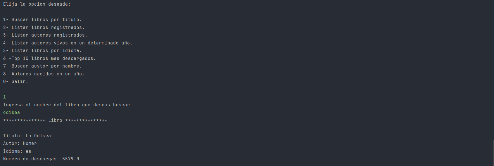
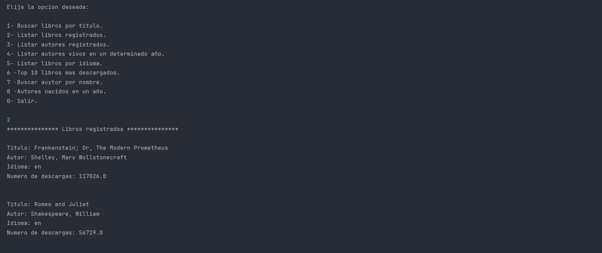
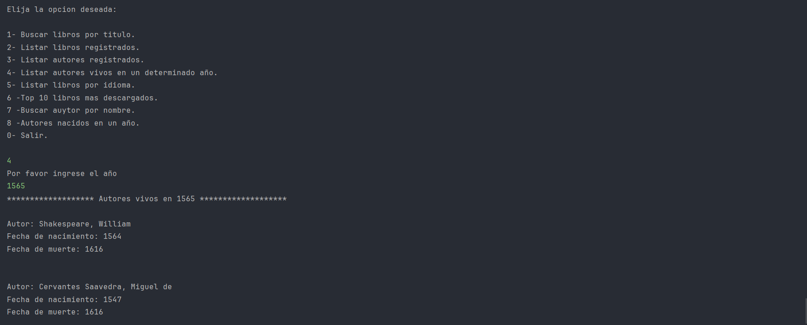
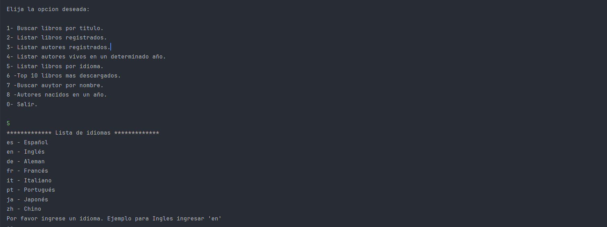
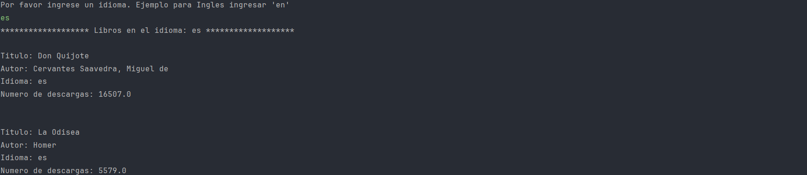

# 📚 Challenge Literalura

Aplicación de consola construida con **Spring Boot** y **JPA** que permite consumir información de libros desde la API pública de [Gutendex](https://gutendex.com) y almacenarlos localmente en una base de datos. El sistema permite realizar búsquedas, filtrado por idioma, años, autores y más.

---

## 🚀 Funcionalidades principales

###  A través del menú interactivo, el usuario puede:
```
1 - Buscar libros por título.
2 - Listar libros registrados.
3 - Listar autores registrados.
4 - Listar autores vivos en un determinado año.
5 - Listar libros por idioma.
6 - Top 10 libros más descargados.
7 - Buscar autor por nombre.
8 - Autores nacidos en un año.
0 - Salir.
```
## 🔨 Algunos ejemplos de uso
### 🔍 Búsqueda de libros por título
El usario debe ingresar un nombre o parte del nombre de un libro y este se muestra en consola.



### 📑 Listado de libros registrados
Se muestra en consola los libros almacenados en la base de datos.



### 👤 Listado de autores vivos en un año específico
El usuario debe ingresar por consola el año en el que decia validar que un actor almacenado en la base de datos este vivo.



### 🌍 Filtro por idioma
Se muestra en consola un listado de idiomas disponibles y el usuario debe ingresar una opcion despues se muestra en consola los libros almacenados en la base de datos en ese idioma.




---

## 🧰 Tecnologías usadas

- Java 21
- Spring Boot 
- Spring Data JPA
- PostgreSQL 
- Jackson
- Maven

---

## ⚙️ Requisitos

- Java 17 o superior
- Maven instalado
- Base de datos PostgreSQL (u otra compatible)
- IDE como IntelliJ o VS Code

---

## 🛠️ Instalación y ejecución

1. Clona este repositorio:
   ```bash
   git clone https://github.com/oscar1098/literalura.git

---

## 📡 API consumida
La aplicación obtiene los datos desde la API pública de [Gutendex](https://gutendex.com), la cual proporciona información detallada de libros y autores del Proyecto Gutenberg.